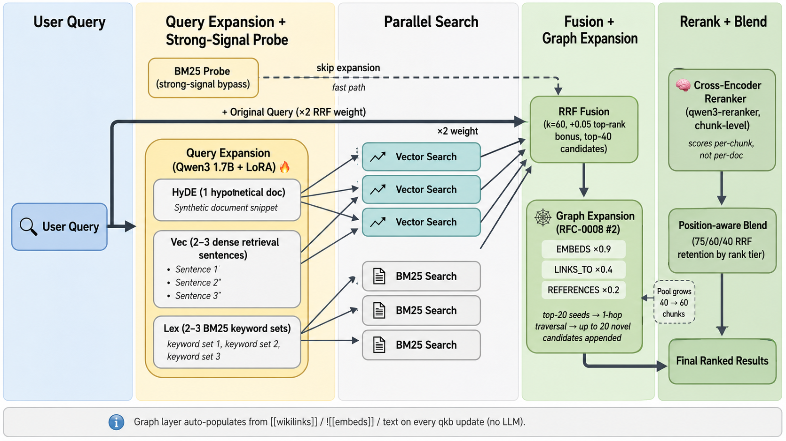

# QKB - Query Knowledge Base

[](https://github.com/danmestas/qkb/actions/workflows/ci.yml)

An on-device search engine for everything you need to remember. Index your markdown notes, meeting transcripts, documentation, and knowledge bases. Search with keywords or natural language. Ideal for your agentic flows.

QKB combines BM25 full-text search, vector semantic search, and LLM re-ranking—all running locally via node-llama-cpp with GGUF models.



You can read more about QKB's progress in the [CHANGELOG](CHANGELOG.md).

## Quick Start

```sh
# Install globally (Node or Bun)
npm install -g @danmestas/qkb
# or
bun install -g @danmestas/qkb

# Or run directly
npx @danmestas/qkb ...
bunx @danmestas/qkb ...

# Create collections for your notes, docs, and meeting transcripts
qkb collection add ~/notes --name notes
qkb collection add ~/Documents/meetings --name meetings
qkb collection add ~/work/docs --name docs

# Add context to help with search results, each piece of context will be returned when matching sub documents are returned. This works as a tree. This is the key feature of QKB as it allows LLMs to make much better contextual choices when selecting documents. Don't sleep on it!
qkb context add qkb://notes "Personal notes and ideas"
qkb context add qkb://meetings "Meeting transcripts and notes"
qkb context add qkb://docs "Work documentation"

# Generate embeddings for semantic search
qkb embed

# Search across everything
qkb search "project timeline"           # Fast keyword search
qkb vsearch "how to deploy"             # Semantic search
qkb query "quarterly planning process"  # Hybrid + reranking + graph (best quality, default)
qkb query "..." --no-graph              # Hybrid without the graph-layer expansion

# Get a specific document
qkb get "meetings/2024-01-15.md"

# Get a document by docid (shown in search results)
qkb get "#abc123"

# Get multiple documents by glob pattern
qkb multi-get "journals/2025-05*.md"

# Search within a specific collection
qkb search "API" -c notes

# Export all matches for an agent
qkb search "API" --all --files --min-score 0.3
```

### Using with AI Agents

QKB's `--json` and `--files` output formats are designed for agentic workflows:

```sh
# Get structured results for an LLM
qkb search "authentication" --json -n 10

# List all relevant files above a threshold
qkb query "error handling" --all --files --min-score 0.4

# Retrieve full document content
qkb get "docs/api-reference.md" --full
```

### MCP Server

Although the tool works perfectly fine when you just tell your agent to use it on the command line, it also exposes an MCP (Model Context Protocol) server for tighter integration.

**Tools exposed:**
- `query` — Search with typed sub-queries (`lex`/`vec`/`hyde`), combined via RRF + reranking
- `get` — Retrieve a document by path or docid (with fuzzy matching suggestions)
- `multi_get` — Batch retrieve by glob pattern, comma-separated list, or docids
- `status` — Index health and collection info

**Claude Desktop configuration** (`~/Library/Application Support/Claude/claude_desktop_config.json`):

```json
{
  "mcpServers": {
    "qkb": {
      "command": "qkb",
      "args": ["mcp"]
    }
  }
}
```

**Claude Code** — Install the plugin (recommended):

```bash
claude plugin marketplace add tobi/qmd
claude plugin install qkb@qkb
```

Or configure MCP manually in `~/.claude/settings.json`:

```json
{
  "mcpServers": {
    "qkb": {
      "command": "qkb",
      "args": ["mcp"]
    }
  }
}
```

#### HTTP Transport

By default, QKB's MCP server uses stdio (launched as a subprocess by each client). For a shared, long-lived server that avoids repeated model loading, use the HTTP transport:

```sh
# Foreground (Ctrl-C to stop)
qkb mcp --http                    # localhost:8181
qkb mcp --http --port 8080        # custom port

# Background daemon
qkb mcp --http --daemon           # start, writes PID to ~/.cache/qkb/mcp.pid
qkb mcp stop                      # stop via PID file
qkb status                        # shows "MCP: running (PID ...)" when active
```

The HTTP server exposes two endpoints:
- `POST /mcp` — MCP Streamable HTTP (JSON responses, stateless)
- `GET /health` — liveness check with uptime

LLM models stay loaded in VRAM across requests. Embedding/reranking contexts are disposed after 5 min idle and transparently recreated on the next request (~1s penalty, models remain loaded).

Point any MCP client at `http://localhost:8181/mcp` to connect.

### SDK / Library Usage

Use QKB as a library in your own Node.js or Bun applications.

#### Installation

```sh
npm install @danmestas/qkb
```

#### Quick Start

```typescript
import { createStore } from '@danmestas/qkb'

const store = await createStore({
  dbPath: './my-index.sqlite',
  config: {
    collections: {
      docs: { path: '/path/to/docs', pattern: '**/*.md' },
    },
  },
})

const results = await store.search({ query: "authentication flow" })
console.log(results.map(r => `${r.title} (${Math.round(r.score * 100)}%)`))

await store.close()
```

#### Store Creation

`createStore()` accepts three modes:

```typescript
import { createStore } from '@danmestas/qkb'

// 1. Inline config — no files needed besides the DB
const store = await createStore({
  dbPath: './index.sqlite',
  config: {
    collections: {
      docs: { path: '/path/to/docs', pattern: '**/*.md' },
      notes: { path: '/path/to/notes' },
    },
  },
})

// 2. YAML config file — collections defined in a file
const store2 = await createStore({
  dbPath: './index.sqlite',
  configPath: './qkb.yml',
})

// 3. DB-only — reopen a previously configured store
const store3 = await createStore({ dbPath: './index.sqlite' })
```

#### Search

The unified `search()` method handles both simple queries and pre-expanded structured queries:

```typescript
// Simple query — auto-expanded via LLM, then BM25 + vector + reranking
const results = await store.search({ query: "authentication flow" })

// With options
const results2 = await store.search({
  query: "rate limiting",
  intent: "API throttling and abuse prevention",
  collection: "docs",
  limit: 5,
  minScore: 0.3,
  explain: true,
})

// Pre-expanded queries — skip auto-expansion, control each sub-query
const results3 = await store.search({
  queries: [
    { type: 'lex', query: '"connection pool" timeout -redis' },
    { type: 'vec', query: 'why do database connections time out under load' },
  ],
  collections: ["docs", "notes"],
})

// Skip reranking for faster results
const fast = await store.search({ query: "auth", rerank: false })
```

For direct backend access:

```typescript
// BM25 keyword search (fast, no LLM)
const lexResults = await store.searchLex("auth middleware", { limit: 10 })

// Vector similarity search (embedding model, no reranking)
const vecResults = await store.searchVector("how users log in", { limit: 10 })

// Manual query expansion for full control
const expanded = await store.expandQuery("auth flow", { intent: "user login" })
const results4 = await store.search({ queries: expanded })
```

#### Retrieval

```typescript
// Get a document by path or docid
const doc = await store.get("docs/readme.md")
const byId = await store.get("#abc123")

if (!("error" in doc)) {
  console.log(doc.title, doc.displayPath, doc.context)
}

// Get document body with line range
const body = await store.getDocumentBody("docs/readme.md", {
  fromLine: 50,
  maxLines: 100,
})

// Batch retrieve by glob or comma-separated list
const { docs, errors } = await store.multiGet("docs/**/*.md", {
  maxBytes: 20480,
})
```

#### Collections

```typescript
// Add a collection
await store.addCollection("myapp", {
  path: "/src/myapp",
  pattern: "**/*.ts",
  ignore: ["node_modules/**", "*.test.ts"],
})

// List collections with document stats
const collections = await store.listCollections()
// => [{ name, pwd, glob_pattern, doc_count, active_count, last_modified, includeByDefault }]

// Get names of collections included in queries by default
const defaults = await store.getDefaultCollectionNames()

// Remove / rename
await store.removeCollection("myapp")
await store.renameCollection("old-name", "new-name")
```

#### Context

Context adds descriptive metadata that improves search relevance and is returned alongside results:

```typescript
// Add context for a path within a collection
await store.addContext("docs", "/api", "REST API reference documentation")

// Set global context (applies to all collections)
await store.setGlobalContext("Internal engineering documentation")

// List all contexts
const contexts = await store.listContexts()
// => [{ collection, path, context }]

// Remove context
await store.removeContext("docs", "/api")
await store.setGlobalContext(undefined)  // clear global
```

#### Indexing

```typescript
// Re-index collections by scanning the filesystem
const result = await store.update({
  collections: ["docs"],  // optional — defaults to all
  onProgress: ({ collection, file, current, total }) => {
    console.log(`[${collection}] ${current}/${total} ${file}`)
  },
})
// => { collections, indexed, updated, unchanged, removed, needsEmbedding }

// Generate vector embeddings
const embedResult = await store.embed({
  force: false,           // true to re-embed everything
  chunkStrategy: "auto",  // "regex" (default) or "auto" (AST for code files)
  onProgress: ({ current, total, collection }) => {
    console.log(`Embedding ${current}/${total}`)
  },
})
```

#### Types

Key types exported for SDK consumers:

```typescript
import type {
  QKBStore,            // The store interface
  SearchOptions,       // Options for search()
  LexSearchOptions,    // Options for searchLex()
  VectorSearchOptions, // Options for searchVector()
  HybridQueryResult,   // Search result with score, snippet, context
  SearchResult,        // Result from searchLex/searchVector
  ExpandedQuery,       // Typed sub-query { type: 'lex'|'vec'|'hyde', query }
  DocumentResult,      // Document metadata + body
  DocumentNotFound,    // Error with similarFiles suggestions
  MultiGetResult,      // Batch retrieval result
  UpdateProgress,      // Progress callback info for update()
  UpdateResult,        // Aggregated update result
  EmbedProgress,       // Progress callback info for embed()
  EmbedResult,         // Embedding result
  StoreOptions,        // createStore() options
  CollectionConfig,    // Inline config shape
  IndexStatus,         // From getStatus()
  IndexHealthInfo,     // From getIndexHealth()
} from '@danmestas/qkb'
```

Utility exports:

```typescript
import {
  extractSnippet,              // Extract a relevant snippet from text
  addLineNumbers,              // Add line numbers to text
  DEFAULT_MULTI_GET_MAX_BYTES, // Default max file size for multiGet (10KB)
  Maintenance,                 // Database maintenance operations
} from '@danmestas/qkb'
```

#### Lifecycle

```typescript
// Close the store — disposes LLM models and DB connection
await store.close()
```

The SDK requires explicit `dbPath` — no defaults are assumed. This makes it safe to embed in any application without side effects.

## Architecture

Since 4.0 (RFC-0009), qkb is a thin wrapper around the
[`@tobilu/qmd`](https://www.npmjs.com/package/@tobilu/qmd) SDK rather than
a fork. qmd owns the **state engine** — `Store`, BM25/vector indexing,
hybrid search, cross-encoder rerank, query expansion. qkb owns the layers
qmd does not expose:

- the **graph layer** (GraphQLite-backed wikilink/embed/reference index,
  edge-weighted 1-hop expansion into the rerank pool — see "Graph Layer"
  below);
- everything under [`src/internals/`](src/internals/) — CLI helpers,
  LlamaCpp lifecycle, YAML collection config, virtual-path (`qkb://...`)
  parsing, short-docid hashing, AST chunking — carved out behind a stable
  boundary so the wrapper edge is auditable;
- the **CLI surface and MCP server**, both of which dispatch through a
  single `dispatchCommand(name, args, ctx)` table that delegates to qmd's
  SDK or to `src/internals/`.

The retrieval pipeline below is implemented inside qmd; qkb's
contribution at query time is the graph-aware rerank-pool rewrite (see
`src/query/rerank-with-graph.ts`).

```
┌─────────────────────────────────────────────────────────────────────────────┐
│                         QKB Hybrid Search Pipeline                          │
└─────────────────────────────────────────────────────────────────────────────┘

                              ┌─────────────────┐
                              │   User Query    │
                              └────────┬────────┘
                                       │
                        ┌──────────────┴──────────────┐
                        ▼                             ▼
               ┌────────────────┐            ┌────────────────┐
               │ Query Expansion│            │  Original Query│
               │  (fine-tuned)  │            │   (×2 weight)  │
               └───────┬────────┘            └───────┬────────┘
                       │                             │
                       │ 2 alternative queries       │
                       └──────────────┬──────────────┘
                                      │
              ┌───────────────────────┼───────────────────────┐
              ▼                       ▼                       ▼
     ┌─────────────────┐     ┌─────────────────┐     ┌─────────────────┐
     │ Original Query  │     │ Expanded Query 1│     │ Expanded Query 2│
     └────────┬────────┘     └────────┬────────┘     └────────┬────────┘
              │                       │                       │
      ┌───────┴───────┐       ┌───────┴───────┐       ┌───────┴───────┐
      ▼               ▼       ▼               ▼       ▼               ▼
  ┌───────┐       ┌───────┐ ┌───────┐     ┌───────┐ ┌───────┐     ┌───────┐
  │ BM25  │       │Vector │ │ BM25  │     │Vector │ │ BM25  │     │Vector │
  │(FTS5) │       │Search │ │(FTS5) │     │Search │ │(FTS5) │     │Search │
  └───┬───┘       └───┬───┘ └───┬───┘     └───┬───┘ └───┬───┘     └───┬───┘
      │               │         │             │         │             │
      └───────┬───────┘         └──────┬──────┘         └──────┬──────┘
              │                        │                       │
              └────────────────────────┼───────────────────────┘
                                       │
                                       ▼
                          ┌───────────────────────┐
                          │   RRF Fusion + Bonus  │
                          │  Original query: ×2   │
                          │  Top-rank bonus: +0.05│
                          │     Top 30 Kept       │
                          └───────────┬───────────┘
                                      │
                                      ▼
                          ┌───────────────────────┐
                          │    LLM Re-ranking     │
                          │  (qwen3-reranker)     │
                          │  Yes/No + logprobs    │
                          └───────────┬───────────┘
                                      │
                                      ▼
                          ┌───────────────────────┐
                          │  Position-Aware Blend │
                          │  Top 1-3:  75% RRF    │
                          │  Top 4-10: 60% RRF    │
                          │  Top 11+:  40% RRF    │
                          └───────────────────────┘
```

## Score Normalization & Fusion

### Search Backends

| Backend | Raw Score | Conversion | Range |
|---------|-----------|------------|-------|
| **FTS (BM25)** | SQLite FTS5 BM25 | `Math.abs(score)` | 0 to ~25+ |
| **Vector** | Cosine distance | `1 / (1 + distance)` | 0.0 to 1.0 |
| **Reranker** | LLM 0-10 rating | `score / 10` | 0.0 to 1.0 |

### Fusion Strategy

The `query` command uses **Reciprocal Rank Fusion (RRF)** with position-aware blending:

1. **Query Expansion**: Original query (×2 for weighting) + 1 LLM variation
2. **Parallel Retrieval**: Each query searches both FTS and vector indexes
3. **RRF Fusion**: Combine all result lists using `score = Σ(1/(k+rank+1))` where k=60
4. **Top-Rank Bonus**: Documents ranking #1 in any list get +0.05, #2-3 get +0.02
5. **Top-K Selection**: Take top 30 candidates for reranking
6. **Re-ranking**: LLM scores each document (yes/no with logprobs confidence)
7. **Position-Aware Blending**:
   - RRF rank 1-3: 75% retrieval, 25% reranker (preserves exact matches)
   - RRF rank 4-10: 60% retrieval, 40% reranker
   - RRF rank 11+: 40% retrieval, 60% reranker (trust reranker more)

**Why this approach**: Pure RRF can dilute exact matches when expanded queries don't match. The top-rank bonus preserves documents that score #1 for the original query. Position-aware blending prevents the reranker from destroying high-confidence retrieval results.

### Score Interpretation

| Score | Meaning |
|-------|---------|
| 0.8 - 1.0 | Highly relevant |
| 0.5 - 0.8 | Moderately relevant |
| 0.2 - 0.5 | Somewhat relevant |
| 0.0 - 0.2 | Low relevance |

## Graph Layer (RFC-0007 + RFC-0008)

QKB indexes structural relationships in your corpus alongside text. For Obsidian-style vaults this means `[[wikilinks]]` (LINKS_TO), `![[embeds]]` (EMBEDS), and relative markdown references (REFERENCES) become typed edges in a SQLite-backed graph (via [GraphQLite](https://github.com/cnamejj/graphqlite)).

### What it does

- **`qkb update`** auto-runs structural extraction after every re-index — no manual step. Idempotent and fast (~30s on a 600-doc vault since the multi-MERGE bulk path).
- **`qkb query`** uses the graph by default — top-20 post-RRF candidates seed a 1-hop edge expansion, weighted by edge type (`EMBEDS=0.9`, `LINKS_TO=0.4`, `REFERENCES=0.2`). Up to 20 graph candidates are appended to the rerank pool. The cross-encoder is the final arbiter — bad graph promotions get demoted automatically.
- **`qkb graph status`** shows node/edge counts. **`qkb graph neighbors <id> --hops N`** explores reachability without writing Cypher. **`qkb graph query "MATCH ..."`** runs arbitrary parameterized Cypher for power users.

### Opting out

Pass `--no-graph` to `qkb query` for the strict pre-RFC-0008 hybrid pipeline:

```sh
qkb query "what regulates flight safety" --no-graph
```

Or disable the layer globally in `~/.config/qkb/{index}.yml`:

```yaml
graph:
  enabled: false
```

The layer also no-ops cleanly on corpora with no wikilinks — no harm to non-Obsidian vaults.

### Tuning per-edge-type weights

```sh
qkb query "..." --graph-weights '{"EMBEDS": 1.0, "LINKS_TO": 0.5}'
```

See `docs/rfcs/0008-hybrid-graph-query.md` for the full strategy catalog (PageRank-from-seeds, ego-graph reranker context, GraphRAG-lite community summaries — strategies #1, #3, #4 documented for future PRs).

## Benchmarks

`qkb` ships a retrieval-quality benchmark at `bench/graph-bench-eval.ts` that runs a fixture of difficult questions through three pipeline depths and scores recall@K against per-question `expected_docs`. Run with:

```sh
npm run bench:graph
# or
npx tsx bench/graph-bench-eval.ts --fixture bench/fixtures/flight-planner-questions.json
```

### Modes compared

| Mode | What it tests |
|---|---|
| `bm25` | `qkb search` — pure FTS5 BM25, no LLM, no graph |
| `hybrid` | `qkb query --no-graph` — query expansion + vector + RRF + cross-encoder rerank |
| `hybrid-graph` | `qkb query` (default) — hybrid + edge-weighted graph expansion |

### Reference results (10-question flight-planner-kb fixture)

| Mode | recall@5 | recall@10 | Top-1 hit rate | Mean latency (warm) |
|---|---|---|---|---|
| bm25 | 0% | 0% | 0% | ~640ms |
| hybrid | 52% | 58% | 30% | ~2s |
| **hybrid-graph** | **52%** | **61%** | 30% | ~7s |

`hybrid-graph` ties hybrid at recall@5 (no displacement of strong lexical hits) and gains +3pp at recall@10 — the graph layer surfaces conceptually-connected docs that pure lexical/vector misses, without breaking the queries lexical/vector handles well. See `bench/results/graph-bench-baseline.md` for the per-question breakdown.

### Methodology

- **`recall@K`**: fraction of the question's curated `expected_docs` that appear in the top-K results.
- **`expected_docs`**: hand-curated per-question. Edit `bench/fixtures/flight-planner-questions.json` to refine; the bench is meant to be iterated on.
- Scoring is deterministic — no LLM judge — so question/expected-doc edits drive score changes predictably.
- Latencies are mean over the fixture with cross-encoder model warm. First query in a session is 15-30× slower (cold model load).
- bm25 is fast (~640ms) but 0% recall on this conceptual fixture — fast-and-blind, included as a control.

### When to use which mode

| Scenario | Recommended mode |
|---|---|
| Exact entity name lookup (`"FAA NMS"`) | `qkb search` (bm25) — fastest; or `qkb query` if recall matters |
| Vague conceptual question | `qkb query` — graph helps with vocabulary mismatch |
| Repeated queries in a session | `qkb query` — models stay warm, ~7s/query |
| Need authoritative citations | `qkb query` + agent reads cited files |
| Vault has no wikilinks | `qkb query --no-graph` — graph is empty, skip the rerank-pool overhead |
| Latency-critical, can't wait 30s cold | `qkb search` (~640ms) or warm up `qkb query` with a throwaway first |

## Requirements

### System Requirements

- **Node.js** >= 22
- **Bun** >= 1.0.0
- **macOS**: Homebrew SQLite (for extension support)
  ```sh
  brew install sqlite
  ```

### GGUF Models (via node-llama-cpp)

QKB uses three local GGUF models (auto-downloaded on first use):

| Model | Purpose | Size |
|-------|---------|------|
| `embeddinggemma-300M-Q8_0` | Vector embeddings (default) | ~300MB |
| `qwen3-reranker-0.6b-q8_0` | Re-ranking | ~640MB |
| `qmd-query-expansion-1.7B-q4_k_m` | Query expansion (fine-tuned) | ~1.1GB |

Models are downloaded from HuggingFace and cached in `~/.cache/qkb/models/`.

### Custom Embedding Model

Override the default embedding model via the `QKB_EMBED_MODEL` environment variable.
This is useful for multilingual corpora (e.g. Chinese, Japanese, Korean) where
`embeddinggemma-300M` has limited coverage.

```sh
# Use Qwen3-Embedding-0.6B for better multilingual (CJK) support
export QKB_EMBED_MODEL="hf:Qwen/Qwen3-Embedding-0.6B-GGUF/Qwen3-Embedding-0.6B-Q8_0.gguf"

# After changing the model, re-embed all collections:
qkb embed -f
```

Supported model families:
- **embeddinggemma** (default) — English-optimized, small footprint
- **Qwen3-Embedding** — Multilingual (119 languages including CJK), MTEB top-ranked

> **Note:** When switching embedding models, you must re-index with `qkb embed -f`
> since vectors are not cross-compatible between models. The prompt format is
> automatically adjusted for each model family.

## Installation

```sh
npm install -g @danmestas/qkb
# or
bun install -g @danmestas/qkb
```

### Development

```sh
git clone https://github.com/tobi/qmd
cd qmd
npm install
npm link
```

## Usage

### Collection Management

```sh
# Create a collection from current directory
qkb collection add . --name myproject

# Create a collection with explicit path and custom glob mask
qkb collection add ~/Documents/notes --name notes --mask "**/*.md"

# List all collections
qkb collection list

# Remove a collection
qkb collection remove myproject

# Rename a collection
qkb collection rename myproject my-project

# List files in a collection
qkb ls notes
qkb ls notes/subfolder
```

### Generate Vector Embeddings

```sh
# Embed all indexed documents (900 tokens/chunk, 15% overlap)
qkb embed

# Force re-embed everything
qkb embed -f

# Enable AST-aware chunking for code files (TS, JS, Python, Go, Rust)
qkb embed --chunk-strategy auto

# Also works with query for consistent chunk selection
qkb query "auth flow" --chunk-strategy auto
```

**AST-aware chunking** (`--chunk-strategy auto`) uses tree-sitter to chunk code
files at function, class, and import boundaries instead of arbitrary text
positions. This produces higher-quality chunks and better search results for
codebases. Markdown and other file types always use regex-based chunking
regardless of strategy.

The default is `regex` (existing behavior). Use `--chunk-strategy auto` to
opt in. Run `qkb status` to verify which grammars are available.

> **Note:** Tree-sitter grammars are optional dependencies. If they are not
> installed, `--chunk-strategy auto` falls back to regex-only chunking
> automatically. Tested on both Node.js and Bun.

### Context Management

Context adds descriptive metadata to collections and paths, helping search understand your content.

```sh
# Add context to a collection (using qkb:// virtual paths)
qkb context add qkb://notes "Personal notes and ideas"
qkb context add qkb://docs/api "API documentation"

# Add context from within a collection directory
cd ~/notes && qkb context add "Personal notes and ideas"
cd ~/notes/work && qkb context add "Work-related notes"

# Add global context (applies to all collections)
qkb context add / "Knowledge base for my projects"

# List all contexts
qkb context list

# Remove context
qkb context rm qkb://notes/old
```

### Search Commands

```
┌──────────────────────────────────────────────────────────────────┐
│                        Search Modes                              │
├──────────┬───────────────────────────────────────────────────────┤
│ search   │ BM25 full-text search only                           │
│ vsearch  │ Vector semantic search only                          │
│ query    │ Hybrid: FTS + Vector + Query Expansion + Re-ranking  │
└──────────┴───────────────────────────────────────────────────────┘
```

```sh
# Full-text search (fast, keyword-based)
qkb search "authentication flow"

# Vector search (semantic similarity)
qkb vsearch "how to login"

# Hybrid search with re-ranking (best quality)
qkb query "user authentication"
```

### Options

```sh
# Search options
-n <num>           # Number of results (default: 5, or 20 for --files/--json)
-c, --collection   # Restrict search to a specific collection
--all              # Return all matches (use with --min-score to filter)
--min-score <num>  # Minimum score threshold (default: 0)
--full             # Show full document content
--line-numbers     # Add line numbers to output
--explain          # Include retrieval score traces (query, JSON/CLI output)
--index <name>     # Use named index

# Output formats (for search and multi-get)
--files            # Output: docid,score,filepath,context
--json             # JSON output with snippets
--csv              # CSV output
--md               # Markdown output
--xml              # XML output

# Get options
qkb get <file>[:line]  # Get document, optionally starting at line
-l <num>               # Maximum lines to return
--from <num>           # Start from line number

# Multi-get options
-l <num>           # Maximum lines per file
--max-bytes <num>  # Skip files larger than N bytes (default: 10KB)
```

### Output Format

Default output is colorized CLI format (respects `NO_COLOR` env).

When stdout is a TTY, result paths are emitted as clickable terminal hyperlinks (OSC 8). Clicking a path opens the file in your editor using an editor URI template.

When stdout is not a TTY (for example piped to another command or redirected to a file), QKB emits plain text paths with no escape sequences.

TTY example:

```
docs/guide.md:42 #a1b2c3
Title: Software Craftsmanship
Context: Work documentation
Score: 93%

This section covers the **craftsmanship** of building
quality software with attention to detail.
See also: engineering principles


notes/meeting.md:15 #d4e5f6
Title: Q4 Planning
Context: Personal notes and ideas
Score: 67%

Discussion about code quality and craftsmanship
in the development process.
```

Configure the editor link target with `QKB_EDITOR_URI` (or `editor_uri` in config):

```sh
# VS Code (default)
export QKB_EDITOR_URI="vscode://file/{path}:{line}:{col}"

# Cursor
export QKB_EDITOR_URI="cursor://file/{path}:{line}:{col}"

# Zed
export QKB_EDITOR_URI="zed://file/{path}:{line}:{col}"

# Sublime Text
export QKB_EDITOR_URI="subl://open?url=file://{path}&line={line}"
```

Template placeholders:
- `{path}` absolute filesystem path (URI-encoded)
- `{line}` 1-based line number
- `{col}` or `{column}` 1-based column number

- **Path**: Collection-relative path (e.g., `docs/guide.md`)
- **Docid**: Short hash identifier (e.g., `#a1b2c3`) - use with `qkb get #a1b2c3`
- **Title**: Extracted from document (first heading or filename)
- **Context**: Path context if configured via `qkb context add`

- **Score**: Color-coded (green >70%, yellow >40%, dim otherwise)
- **Snippet**: Context around match with query terms highlighted

### Examples

```sh
# Get 10 results with minimum score 0.3
qkb query -n 10 --min-score 0.3 "API design patterns"

# Output as markdown for LLM context
qkb search --md --full "error handling"

# JSON output for scripting
qkb query --json "quarterly reports"

# Inspect how each result was scored (RRF + rerank blend)
qkb query --json --explain "quarterly reports"

# Use separate index for different knowledge base
qkb --index work search "quarterly reports"
```

### Index Maintenance

```sh
# Show index status and collections with contexts
qkb status

# Re-index all collections
qkb update

# Re-index with git pull first (for remote repos)
qkb update --pull

# Get document by filepath (with fuzzy matching suggestions)
qkb get notes/meeting.md

# Get document by docid (from search results)
qkb get "#abc123"

# Get document starting at line 50, max 100 lines
qkb get notes/meeting.md:50 -l 100

# Get multiple documents by glob pattern
qkb multi-get "journals/2025-05*.md"

# Get multiple documents by comma-separated list (supports docids)
qkb multi-get "doc1.md, doc2.md, #abc123"

# Limit multi-get to files under 20KB
qkb multi-get "docs/*.md" --max-bytes 20480

# Output multi-get as JSON for agent processing
qkb multi-get "docs/*.md" --json

# Clean up cache and orphaned data
qkb cleanup
```

## Data Storage

Index stored in: `~/.cache/qkb/index.sqlite`

### Schema

```sql
collections     -- Indexed directories with name and glob patterns
path_contexts   -- Context descriptions by virtual path (qkb://...)
documents       -- Markdown content with metadata and docid (6-char hash)
documents_fts   -- FTS5 full-text index
content_vectors -- Embedding chunks (hash, seq, pos, 900 tokens each)
vectors_vec     -- sqlite-vec vector index (hash_seq key)
llm_cache       -- Cached LLM responses (query expansion, rerank scores)
```

## Environment Variables

| Variable | Default | Description |
|----------|---------|-------------|
| `XDG_CACHE_HOME` | `~/.cache` | Cache directory location |

## How It Works

### Indexing Flow

```
Collection ──► Glob Pattern ──► Markdown Files ──► Parse Title ──► Hash Content
    │                                                   │              │
    │                                                   │              ▼
    │                                                   │         Generate docid
    │                                                   │         (6-char hash)
    │                                                   │              │
    └──────────────────────────────────────────────────►└──► Store in SQLite
                                                                       │
                                                                       ▼
                                                                  FTS5 Index
```

### Embedding Flow

Documents are chunked into ~900-token pieces with 15% overlap using smart boundary detection:

```
Document ──► Smart Chunk (~900 tokens) ──► Format each chunk ──► node-llama-cpp ──► Store Vectors
                │                           "title | text"        embedBatch()
                │
                └─► Chunks stored with:
                    - hash: document hash
                    - seq: chunk sequence (0, 1, 2...)
                    - pos: character position in original
```

### Smart Chunking

Instead of cutting at hard token boundaries, QKB uses a scoring algorithm to find natural markdown break points. This keeps semantic units (sections, paragraphs, code blocks) together.

**Break Point Scores:**

| Pattern | Score | Description |
|---------|-------|-------------|
| `# Heading` | 100 | H1 - major section |
| `## Heading` | 90 | H2 - subsection |
| `### Heading` | 80 | H3 |
| `#### Heading` | 70 | H4 |
| `##### Heading` | 60 | H5 |
| `###### Heading` | 50 | H6 |
| ` ``` ` | 80 | Code block boundary |
| `---` / `***` | 60 | Horizontal rule |
| Blank line | 20 | Paragraph boundary |
| `- item` / `1. item` | 5 | List item |
| Line break | 1 | Minimal break |

**Algorithm:**

1. Scan document for all break points with scores
2. When approaching the 900-token target, search a 200-token window before the cutoff
3. Score each break point: `finalScore = baseScore × (1 - (distance/window)² × 0.7)`
4. Cut at the highest-scoring break point

The squared distance decay means a heading 200 tokens back (score ~30) still beats a simple line break at the target (score 1), but a closer heading wins over a distant one.

**Code Fence Protection:** Break points inside code blocks are ignored—code stays together. If a code block exceeds the chunk size, it's kept whole when possible.

**AST-Aware Chunking (Code Files):**

For supported code files, QKB also parses the source with [tree-sitter](https://tree-sitter.github.io/) and adds AST-derived break points that are merged with the regex scores above:

| AST Node | Score | Languages |
|----------|-------|-----------|
| Class / interface / struct / impl / trait | 100 | All |
| Function / method | 90 | All |
| Type alias / enum | 80 | All |
| Import / use declaration | 60 | All |

Supported for `.ts`, `.tsx`, `.js`, `.jsx`, `.py`, `.go`, and `.rs` files. Enable with `--chunk-strategy auto`. Markdown and other file types always use regex chunking.

### Query Flow (Hybrid)

```
Query ──► LLM Expansion ──► [Original, Variant 1, Variant 2]
                │
      ┌─────────┴─────────┐
      ▼                   ▼
   For each query:     FTS (BM25)
      │                   │
      ▼                   ▼
   Vector Search      Ranked List
      │
      ▼
   Ranked List
      │
      └─────────┬─────────┘
                ▼
         RRF Fusion (k=60)
         Original query ×2 weight
         Top-rank bonus: +0.05/#1, +0.02/#2-3
                │
                ▼
         Top 30 candidates
                │
                ▼
         LLM Re-ranking
         (yes/no + logprob confidence)
                │
                ▼
         Position-Aware Blend
         Rank 1-3:  75% RRF / 25% reranker
         Rank 4-10: 60% RRF / 40% reranker
         Rank 11+:  40% RRF / 60% reranker
                │
                ▼
         Final Results
```

## Model Configuration

Models are configured in `src/llm.ts` as HuggingFace URIs:

```typescript
const DEFAULT_EMBED_MODEL = "hf:ggml-org/embeddinggemma-300M-GGUF/embeddinggemma-300M-Q8_0.gguf";
const DEFAULT_RERANK_MODEL = "hf:ggml-org/Qwen3-Reranker-0.6B-Q8_0-GGUF/qwen3-reranker-0.6b-q8_0.gguf";
const DEFAULT_GENERATE_MODEL = "hf:tobil/qmd-query-expansion-1.7B-gguf/qmd-query-expansion-1.7B-q4_k_m.gguf";
```

### EmbeddingGemma Prompt Format

```
// For queries
"task: search result | query: {query}"

// For documents
"title: {title} | text: {content}"
```

### Qwen3-Reranker

Uses node-llama-cpp's `createRankingContext()` and `rankAndSort()` API for cross-encoder reranking. Returns documents sorted by relevance score (0.0 - 1.0).

### Qwen3 (Query Expansion)

Used for generating query variations via `LlamaChatSession`.

## License

MIT
